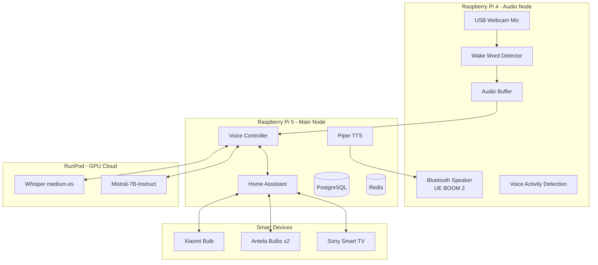

# Proyecto Charo - Asistente de Voz para WayneHomeLab

## 📋 Resumen Ejecutivo

**Charo** es un asistente de voz open-source tipo Alexa, diseñado para funcionar en Raspberry Pi con integración a Home Assistant. Utiliza una arquitectura distribuida con procesamiento edge y cloud (RunPod) para optimizar rendimiento y coste.

### Características Principales
- Wake word always-on: "Oye, Charo"
- Control de luces WiFi (Xiaomi, Antela/Tuya)
- Control de Smart TV Sony
- Respuesta en 2-3 segundos
- Voz española femenina natural
- Presupuesto: <20€/mes en RunPod

## 🏗️ Arquitectura del Sistema

### Distribución de Hardware



### Pipeline de Procesamiento

```python
# Flujo completo de interacción
1. DETECCIÓN (Pi4)
   ├── Audio continuo desde webcam USB (16kHz, mono)
   ├── OpenWakeWord detecta "Oye, Charo"
   └── Activa grabación con feedback sonoro

2. CAPTURA (Pi4)
   ├── Silero VAD detecta inicio de habla
   ├── Graba hasta detectar silencio (1.5s)
   └── WebSocket stream a Pi5

3. TRANSCRIPCIÓN (Pi5 → RunPod)
   ├── Whisper medium.es convierte audio a texto
   ├── Cache check para comandos frecuentes
   └── Fallback a whisper.cpp local si falla

4. PROCESAMIENTO (Pi5 ↔ RunPod)
   ├── Intent recognition local (comandos simples)
   ├── LLM para comandos complejos (Mistral-7B)
   └── Generación de respuesta contextual

5. EJECUCIÓN (Pi5)
   ├── Home Assistant API calls
   ├── Estado de dispositivos update
   └── Confirmación de acción

6. RESPUESTA (Pi5 → Pi4)
   ├── Piper TTS genera audio (voz es_ES-davefx-medium)
   ├── Stream a PulseAudio
   └── Output por Bluetooth speaker
```

## 💰 Optimización Coste-Rendimiento RunPod

### Configuración Serverless Recomendada

```python
# runpod_config.py
RUNPOD_CONFIG = {
    "serverless": {
        "template_id": "custom-charo-endpoint",
        "min_workers": 0,  # Scale to zero cuando no se usa
        "max_workers": 1,  # Un worker es suficiente
        "idle_timeout": 60,  # Mantener activo 1 min después de uso
        "gpu_type": "RTX 3090",  # Mejor ratio precio/rendimiento
        "container_disk": 20,  # GB
        "models": {
            "whisper": "medium",  # 1.5GB VRAM
            "llm": "TheBloke/Mistral-7B-Instruct-v0.2-GGUF",  # 4-bit, ~5GB VRAM
            "quantization": "Q4_K_M"
        }
    },
    "estimated_cost": {
        "per_hour_active": 0.44,  # USD
        "monthly_estimate": 15.00,  # USD con uso moderado (~30h/mes)
    }
}
```

### Estrategia de Cache

```python
# cache_strategy.py
CACHE_PATTERNS = {
    "instant_commands": {  # Ejecutar localmente sin LLM
        "enciende la luz": "light.turn_on",
        "apaga la luz": "light.turn_off",
        "sube el volumen": "media_player.volume_up",
        "baja el volumen": "media_player.volume_down",
    },
    "cached_responses": {  # Respuestas pre-generadas
        "qué hora es": lambda: f"Son las {datetime.now().strftime('%H:%M')}",
        "qué día es hoy": lambda: f"Hoy es {datetime.now().strftime('%A %d de %B')}",
    },
    "ttl_seconds": 3600  # Cache temporal para respuestas LLM
}
```

## 🏠 Integración Home Assistant

### Configuración de Dispositivos

```yaml
# configuration.yaml
homeassistant:
  name: WayneHome
  latitude: !secret home_latitude
  longitude: !secret home_longitude
  elevation: !secret home_elevation
  unit_system: metric
  time_zone: Europe/Madrid

# Xiaomi Bulb
xiaomi_miio:
  - platform: xiaomi_miio
    host: 192.168.1.XXX
    token: !secret xiaomi_token
    model: yeelink.light.color2
    name: "Luz Xiaomi"

# Antela Smart Bulbs (Tuya)
tuya:
  username: !secret tuya_username
  password: !secret tuya_password
  country_code: "34"
  platform: smart_life

# Sony Smart TV
media_player:
  - platform: sonybravia
    host: 192.168.1.XXX
    psk: !secret sony_psk
    name: "TV Sony"

# Webhook para Charo
webhook:
  - webhook_id: charo_voice_command
    allowed_methods:
      - POST
    local_only: true
```

### API Endpoints para Charo

```python
# home_assistant_client.py
class HomeAssistantClient:
    def __init__(self, host, token):
        self.base_url = f"http://{host}:8123/api"
        self.headers = {
            "Authorization": f"Bearer {token}",
            "Content-Type": "application/json"
        }
    
    async def control_light(self, entity_id: str, action: str):
        """Control luces: on, off, brightness, color"""
        service = f"light.turn_{action}"
        await self.call_service("light", service, {"entity_id": entity_id})
    
    async def control_tv(self, action: str):
        """Control TV: on, off, volume, source"""
        entity = "media_player.tv_sony"
        service_map = {
            "encender": "turn_on",
            "apagar": "turn_off",
            "netflix": "select_source",
        }
        await self.call_service("media_player", service_map[action], {
            "entity_id": entity,
            "source": "Netflix" if action == "netflix" else None
        })
```

## 🎤 Configuración de Audio

### Wake Word Training

```python
# wake_word_config.py
WAKE_WORD_CONFIG = {
    "model": "openwakeword",
    "phrase": "oye charo",
    "threshold": 0.5,  # Sensibilidad (0.3-0.7)
    "audio_gain": 1.5,  # Amplificación para webcam
    "pre_emphasis": 0.97,  # Filtro high-pass
    "training_samples": [  # Grabar muestras tuyas y de tu novia
        "samples/wayne_oye_charo_1.wav",
        "samples/wayne_oye_charo_2.wav",
        "samples/girlfriend_oye_charo_1.wav",
        "samples/girlfriend_oye_charo_2.wav",
    ]
}
```

### TTS Configuration

```python
# tts_config.py
TTS_CONFIG = {
    "engine": "piper",
    "model": "es_ES-davefx-medium",  # Voz femenina española
    "speaker": 0,
    "speed": 1.0,
    "noise_scale": 0.667,
    "length_scale": 1.0,
    "audio_format": {
        "sample_rate": 22050,
        "channels": 1,
        "sample_width": 2  # 16-bit
    }
}
```

## 📁 Estructura del Proyecto

```
WayneHomeLab/
├── docker-compose.yml
├── .env.example
├── .github/
│   └── workflows/
│       ├── test.yml         # CI: Linting y tests
│       └── deploy.yml       # CD: Deploy a Pis
│
├── services/
│   ├── charo-core/          # Servicio principal (Pi5)
│   │   ├── Dockerfile
│   │   ├── requirements.txt
│   │   ├── src/
│   │   │   ├── main.py
│   │   │   ├── voice_controller.py
│   │   │   ├── intent_engine.py
│   │   │   ├── ha_client.py
│   │   │   ├── cache_manager.py
│   │   │   └── config.py
│   │   └── tests/
│   │
│   ├── audio-service/       # Servicio de audio (Pi4)
│   │   ├── Dockerfile
│   │   ├── requirements.txt
│   │   ├── src/
│   │   │   ├── audio_capture.py
│   │   │   ├── wake_word.py
│   │   │   ├── vad.py
│   │   │   ├── bluetooth_manager.py
│   │   │   └── stream_client.py
│   │   └── models/
│   │       └── wake_word.onnx
│   │
│   ├── runpod-gateway/      # Cliente RunPod
│   │   ├── requirements.txt
│   │   ├── serverless_handler.py
│   │   ├── whisper_service.py
│   │   └── llm_service.py
│   │
│   └── home-assistant/
│       ├── config/
│       │   ├── configuration.yaml
│       │   ├── automations.yaml
│       │   ├── scripts.yaml
│       │   └── secrets.yaml.example
│       └── custom_components/
│           └── charo_integration/
│
├── deployment/
│   ├── docker/
│   │   ├── pi5-compose.yml
│   │   └── pi4-compose.yml
│   ├── scripts/
│   │   ├── install_pi5.sh
│   │   ├── install_pi4.sh
│   │   └── setup_bluetooth.sh
│   └── ansible/              # Para futuro
│
├── docs/
│   ├── ARCHITECTURE.md
│   ├── SETUP.md
│   ├── TROUBLESHOOTING.md
│   └── API.md
│
└── tools/
    ├── test_audio.py        # Test micrófono/altavoz
    ├── train_wake_word.py   # Entrenar modelo personal
    └── benchmark.py         # Medir latencias
```

## 🚀 Plan de Implementación

### Fase 1: Foundation (Semana 1)
- [ ] Setup inicial de repositorio
- [ ] Configurar Pi5 con Docker y servicios base
- [ ] Instalar y configurar Home Assistant
- [ ] Integrar bombillas Xiaomi y Antela
- [ ] Test de control manual via HA

### Fase 2: Audio Pipeline (Semana 2)
- [ ] Configurar Pi4 con PulseAudio y Bluetooth
- [ ] Implementar captura de audio desde webcam
- [ ] Entrenar wake word "Oye, Charo"
- [ ] Implementar VAD y streaming
- [ ] Test de detección y captura

### Fase 3: RunPod Integration (Semana 3)
- [ ] Setup cuenta RunPod serverless
- [ ] Deploy Whisper medium.es
- [ ] Deploy Mistral-7B con vLLM
- [ ] Implementar cliente Python
- [ ] Optimizar cold start y latencia

### Fase 4: Voice Controller (Semana 4)
- [ ] Implementar intent recognition
- [ ] Crear mapeo comandos -> acciones HA
- [ ] Setup Piper TTS voz femenina
- [ ] Implementar cache manager
- [ ] Test end-to-end del pipeline

### Fase 5: Optimización (Semana 5)
- [ ] Profiling de latencias
- [ ] Implementar respuestas pre-cached
- [ ] Ajustar thresholds de wake word
- [ ] Mejorar manejo de errores
- [ ] Tests con múltiples usuarios

## 🔧 Comandos de Desarrollo

### Setup Inicial

```bash
# Clonar repo
git clone https://github.com/tu-usuario/WayneHomeLab.git
cd WayneHomeLab

# Configurar environment
cp .env.example .env
# Editar .env con tus tokens y configuraciones

# Build inicial
docker-compose build

# Deploy a Pi5
./deployment/scripts/install_pi5.sh

# Deploy a Pi4
./deployment/scripts/install_pi4.sh
```

### Desarrollo Local

```bash
# Levantar servicios core
docker-compose up -d postgres redis

# Desarrollo con hot-reload
cd services/charo-core
python -m venv venv
source venv/bin/activate
pip install -r requirements.txt
python src/main.py --dev

# Tests
pytest tests/ -v --cov=src

# Linting
black src/ tests/
flake8 src/ tests/
mypy src/
```

### Monitoreo

```bash
# Logs en tiempo real
docker-compose logs -f charo-core

# Métricas de latencia
python tools/benchmark.py

# Test de audio
python tools/test_audio.py --device "USB Webcam"

# Health check
curl http://pi5.local:8080/health
```

## 🎯 KPIs y Métricas

### Objetivos de Rendimiento

| Métrica | Target | Actual |
|---------|--------|--------|
| Wake word accuracy | >95% | - |
| Latencia total (wake→respuesta) | <3s | - |
| Precisión intent | >90% | - |
| Uptime servicio | >99% | - |
| Coste mensual RunPod | <20€ | - |
| Uso CPU Pi5 | <60% | - |
| Uso RAM Pi5 | <2GB | - |

### Logs y Telemetría

```python
# Estructura de logs
{
    "timestamp": "2024-01-15T10:30:45.123Z",
    "session_id": "uuid-v4",
    "user_id": "wayne|girlfriend",  # Identificación por voz
    "event_type": "command_processed",
    "latencies": {
        "wake_word_detection": 0.05,
        "audio_capture": 1.2,
        "stt": 0.8,
        "intent_recognition": 0.1,
        "llm_processing": 0.9,
        "action_execution": 0.2,
        "tts": 0.3,
        "total": 3.55
    },
    "command": "enciende la luz del salón",
    "intent": "control_light",
    "success": true
}
```

## 🔐 Seguridad

### Configuración de Red

```yaml
# docker-compose.yml - Network isolation
networks:
  charo_public:
    driver: bridge
  charo_private:
    driver: bridge
    internal: true

services:
  charo-core:
    networks:
      - charo_public
      - charo_private
  
  postgres:
    networks:
      - charo_private  # Solo accesible internamente
```

### Secrets Management

```bash
# Usar Docker secrets o .env files
RUNPOD_API_KEY=xxx
HOME_ASSISTANT_TOKEN=xxx
XIAOMI_TOKEN=xxx
TUYA_USERNAME=xxx
TUYA_PASSWORD=xxx
POSTGRES_PASSWORD=xxx
```

## 🚧 Problemas Conocidos y Soluciones

### 1. Bluetooth Audio Lag
**Problema**: Latencia en altavoz Bluetooth
**Solución**: Buffer pre-carga + ajuste latency_msec en PulseAudio

### 2. Wake Word False Positives
**Problema**: Se activa sin decir "Oye, Charo"
**Solución**: Subir threshold a 0.6-0.7, entrenar con más samples negativos

### 3. RunPod Cold Start
**Problema**: Primera petición tarda 20-30s
**Solución**: Keep-alive cada 5 minutos + cache agresivo

### 4. Xiaomi Token
**Problema**: Obtener token de bombilla Xiaomi
**Solución**: Usar `python-miio` o app modificada

## 📈 Roadmap Futuro

### v2.0 - Multi-Room (Mes 2)
- [ ] Soporte múltiples micrófonos ESP32
- [ ] Localización de usuario por audio
- [ ] Respuesta direccional

### v3.0 - Contexto y Memoria (Mes 3)
- [ ] Integración MCP servers
- [ ] Memoria conversacional con PostgreSQL
- [ ] Perfiles de usuario personalizados

### v4.0 - Nube Privada (Mes 4)
- [ ] Nextcloud integration
- [ ] Calendar y email sync
- [ ] RAG sobre documentos personales

## 📞 Soporte y Contacto

- **GitHub Issues**: [WayneHomeLab/issues](https://github.com/tu-usuario/WayneHomeLab/issues)
- **Documentation**: [/docs](./docs/)
- **Discord**: [Próximamente]

---

*Última actualización: Enero 2025*
*Versión: 1.0.0-alpha*
*Autor: Wayne*
*Licencia: MIT*