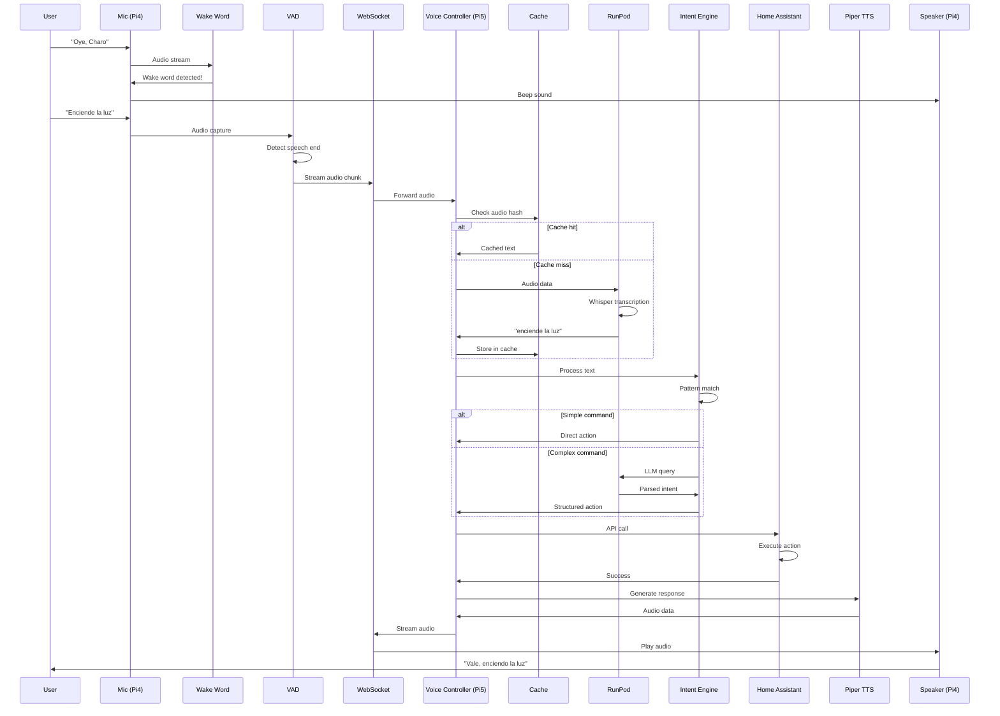

# Arquitectura del Proyecto Charo

## Índice

1. [Visión General](#visión-general)
2. [Distribución de Hardware](#distribución-de-hardware)
3. [Arquitectura de Software](#arquitectura-de-software)
4. [Pipeline de Procesamiento](#pipeline-de-procesamiento)
5. [Flujo de Datos](#flujo-de-datos)
6. [Componentes Detallados](#componentes-detallados)
7. [Decisiones de Diseño](#decisiones-de-diseño)

---

## Visión General

Charo es un asistente de voz distribuido que utiliza una arquitectura edge-cloud híbrida para optimizar latencia y costes. El sistema procesa comandos de voz en tiempo real y controla dispositivos smart home a través de Home Assistant.

### Principios Arquitectónicos

- **Edge Processing**: Procesamiento local para comandos simples y baja latencia
- **Cloud Offloading**: GPU cloud (RunPod) solo para tareas intensivas (STT/LLM)
- **Fail-Safe**: Fallbacks locales si RunPod no está disponible
- **Modularidad**: Servicios independientes comunicados por WebSocket/HTTP
- **Escalabilidad**: Preparado para múltiples nodos de audio (v2.0)

---

## Distribución de Hardware

### Raspberry Pi 4 - Audio Node

**Rol**: Captura de audio y reproducción de respuestas

**Hardware**:
- Raspberry Pi 4 Model B (4GB RAM)
- Micrófono: Webcam USB con micrófono integrado
- Altavoz: UE BOOM 2 (Bluetooth)
- Almacenamiento: SD Card 32GB

**Servicios**:
```
┌─────────────────────────────────────┐
│     Raspberry Pi 4 - Audio Node     │
├─────────────────────────────────────┤
│  ┌───────────────────────────────┐  │
│  │   Wake Word Detector (ONNX)   │  │
│  │   - OpenWakeWord              │  │
│  │   - Always-on listening       │  │
│  └───────────────────────────────┘  │
│  ┌───────────────────────────────┐  │
│  │   Voice Activity Detection    │  │
│  │   - Silero VAD               │  │
│  │   - Silence detection         │  │
│  └───────────────────────────────┘  │
│  ┌───────────────────────────────┐  │
│  │   Audio Capture Service       │  │
│  │   - 16kHz mono capture        │  │
│  │   - Audio preprocessing       │  │
│  └───────────────────────────────┘  │
│  ┌───────────────────────────────┐  │
│  │   WebSocket Client            │  │
│  │   - Stream audio to Pi5       │  │
│  │   - Receive TTS audio         │  │
│  └───────────────────────────────┘  │
│  ┌───────────────────────────────┐  │
│  │   Bluetooth Audio Manager     │  │
│  │   - PulseAudio integration    │  │
│  │   - UE BOOM 2 output          │  │
│  └───────────────────────────────┘  │
└─────────────────────────────────────┘
```

**Consumo estimado**: ~3W (sin picos de audio)

---

### Raspberry Pi 5 - Main Node

**Rol**: Orquestación, IA local, Home Assistant

**Hardware**:
- Raspberry Pi 5 (8GB RAM)
- Almacenamiento: SSD USB 256GB
- Red: Gigabit Ethernet

**Servicios**:
```
┌──────────────────────────────────────────┐
│      Raspberry Pi 5 - Main Node          │
├──────────────────────────────────────────┤
│  ┌────────────────────────────────────┐  │
│  │      Voice Controller Core         │  │
│  │  - WebSocket Server                │  │
│  │  - Pipeline orchestration          │  │
│  │  - State management                │  │
│  └────────────────────────────────────┘  │
│  ┌────────────────────────────────────┐  │
│  │      Intent Recognition Engine     │  │
│  │  - Pattern matching                │  │
│  │  - Local classification            │  │
│  │  - Command routing                 │  │
│  └────────────────────────────────────┘  │
│  ┌────────────────────────────────────┐  │
│  │      Home Assistant Client         │  │
│  │  - REST API integration            │  │
│  │  - Device control                  │  │
│  │  - State queries                   │  │
│  └────────────────────────────────────┘  │
│  ┌────────────────────────────────────┐  │
│  │      Cache Manager (Redis)         │  │
│  │  - Command caching                 │  │
│  │  - Response pre-generation         │  │
│  │  - Device state cache              │  │
│  └────────────────────────────────────┘  │
│  ┌────────────────────────────────────┐  │
│  │      Piper TTS                     │  │
│  │  - es_ES-davefx-medium             │  │
│  │  - Audio streaming                 │  │
│  └────────────────────────────────────┘  │
│  ┌────────────────────────────────────┐  │
│  │      PostgreSQL                    │  │
│  │  - Conversation history            │  │
│  │  - Telemetry data                  │  │
│  └────────────────────────────────────┘  │
│  ┌────────────────────────────────────┐  │
│  │      Home Assistant                │  │
│  │  - Smart home hub                  │  │
│  │  - Xiaomi/Tuya/Sony integration    │  │
│  └────────────────────────────────────┘  │
└──────────────────────────────────────────┘
```

**Consumo estimado**: ~5-8W

---

### RunPod Cloud - GPU Processing

**Rol**: Procesamiento de IA intensivo

**Hardware**:
- GPU: RTX 3090 (24GB VRAM)
- Serverless deployment (scale to zero)

**Servicios**:
```
┌──────────────────────────────────────────┐
│         RunPod Serverless GPU            │
├──────────────────────────────────────────┤
│  ┌────────────────────────────────────┐  │
│  │   Whisper STT Service              │  │
│  │   - Model: medium                  │  │
│  │   - Language: Spanish (es)         │  │
│  │   - VRAM: ~1.5GB                   │  │
│  │   - Latency: ~800ms                │  │
│  └────────────────────────────────────┘  │
│  ┌────────────────────────────────────┐  │
│  │   Mistral-7B LLM Service           │  │
│  │   - Model: Instruct-v0.2           │  │
│  │   - Quantization: Q4_K_M           │  │
│  │   - VRAM: ~5GB                     │  │
│  │   - Latency: ~900ms                │  │
│  └────────────────────────────────────┘  │
└──────────────────────────────────────────┘
```

**Coste estimado**: $0.44/hora activa (~$15/mes con uso moderado)

---

## Arquitectura de Software

### Stack Tecnológico

```yaml
Backend:
  Language: Python 3.11+
  Framework: FastAPI
  Async: asyncio, aiohttp
  WebSockets: websockets library

Audio Processing:
  Wake Word: OpenWakeWord (ONNX)
  VAD: Silero VAD
  TTS: Piper (local)
  STT: Whisper (RunPod)

AI/ML:
  LLM: Mistral-7B-Instruct
  Quantization: GGUF Q4_K_M
  Inference: vLLM (RunPod)

Storage:
  Database: PostgreSQL 15
  Cache: Redis 7
  File Storage: Local SSD

Home Automation:
  Hub: Home Assistant
  Integrations:
    - Xiaomi miIO
    - Tuya/Smart Life
    - Sony Bravia

Infrastructure:
  Containerization: Docker
  Orchestration: Docker Compose
  Networking: Bridge networks
```

---

## Pipeline de Procesamiento

### Flujo Completo (End-to-End)

```
┌─────────────────────────────────────────────────────────────────────┐
│                         FULL VOICE PIPELINE                         │
└─────────────────────────────────────────────────────────────────────┘

1. WAKE WORD DETECTION (Pi4)
   ┌──────────────────────────────┐
   │ Microphone Capture (16kHz)   │ ──┐
   └──────────────────────────────┘   │
                                      ▼
   ┌──────────────────────────────┐
   │ OpenWakeWord "oye charo"     │
   │ Confidence > 0.5             │
   └──────────────────────────────┘
                │
                ▼
   [🔊 Beep feedback sound]
                │
                ▼

2. VOICE CAPTURE (Pi4)
   ┌──────────────────────────────┐
   │ Silero VAD starts recording  │
   └──────────────────────────────┘
                │
                ▼
   ┌──────────────────────────────┐
   │ Detect speech end (1.5s)     │
   └──────────────────────────────┘
                │
                ▼
   ┌──────────────────────────────┐
   │ WebSocket stream → Pi5       │
   └──────────────────────────────┘
                │
                ▼

3. TRANSCRIPTION (Pi5 → RunPod)
   ┌──────────────────────────────┐
   │ Check Redis cache            │
   │ (audio hash lookup)          │
   └──────────────────────────────┘
        │               │
        │ MISS          │ HIT
        ▼               ▼
   ┌─────────────┐  ┌─────────────┐
   │ RunPod      │  │ Return      │
   │ Whisper STT │  │ cached text │
   └─────────────┘  └─────────────┘
        │               │
        └───────┬───────┘
                ▼
   ┌──────────────────────────────┐
   │ Text: "enciende la luz"      │
   └──────────────────────────────┘
                │
                ▼

4. INTENT RECOGNITION (Pi5)
   ┌──────────────────────────────┐
   │ Pattern matching             │
   │ "enciende|apaga luz"         │
   └──────────────────────────────┘
        │               │
        │ MATCH         │ NO MATCH
        ▼               ▼
   ┌─────────────┐  ┌─────────────┐
   │ Direct      │  │ RunPod LLM  │
   │ action      │  │ processing  │
   └─────────────┘  └─────────────┘
        │               │
        └───────┬───────┘
                ▼
   ┌──────────────────────────────┐
   │ Intent: control_light        │
   │ Entity: light.xiaomi         │
   │ Action: turn_on              │
   └──────────────────────────────┘
                │
                ▼

5. EXECUTION (Pi5)
   ┌──────────────────────────────┐
   │ Home Assistant API call      │
   │ POST /api/services/light/... │
   └──────────────────────────────┘
                │
                ▼
   ┌──────────────────────────────┐
   │ Device control               │
   │ (Xiaomi bulb turns on)       │
   └──────────────────────────────┘
                │
                ▼
   ┌──────────────────────────────┐
   │ Generate response            │
   │ "Vale, enciendo la luz"      │
   └──────────────────────────────┘
                │
                ▼

6. RESPONSE (Pi5 → Pi4)
   ┌──────────────────────────────┐
   │ Piper TTS synthesis          │
   │ (es_ES-davefx-medium)        │
   └──────────────────────────────┘
                │
                ▼
   ┌──────────────────────────────┐
   │ Stream audio via WebSocket   │
   └──────────────────────────────┘
                │
                ▼
   ┌──────────────────────────────┐
   │ Play through Bluetooth       │
   │ (UE BOOM 2)                  │
   └──────────────────────────────┘
                │
                ▼
   [🔊 "Vale, enciendo la luz"]
```

### Latencias por Etapa

| Etapa | Target | Notas |
|-------|--------|-------|
| Wake word detection | 50ms | Local ONNX |
| Audio capture | 1200ms | Hasta fin de speech |
| WebSocket transmission | 50ms | LAN |
| STT (RunPod) | 800ms | Cache miss |
| STT (cached) | 10ms | Cache hit |
| Intent recognition | 100ms | Pattern match |
| LLM processing | 900ms | Solo comandos complejos |
| HA API call | 200ms | LAN |
| TTS generation | 300ms | Piper local |
| Audio streaming | 50ms | LAN |
| **TOTAL (optimistic)** | **~2.5s** | 80% de casos |
| **TOTAL (with LLM)** | **~3.5s** | 20% de casos |

---

## Flujo de Datos

### Diagrama de Secuencia



---

## Componentes Detallados

### 1. Audio Service (Pi4)

**Archivo**: `services/audio-service/`

#### Responsabilidades
- Captura continua de audio
- Detección de wake word
- VAD y segmentación
- Streaming bidireccional
- Reproducción de respuestas

#### Módulos

```python
audio_capture.py
├── AudioCaptureManager
│   ├── initialize_microphone()
│   ├── start_capture()
│   ├── apply_preprocessing()
│   └── get_audio_chunk()

wake_word.py
├── WakeWordDetector
│   ├── load_model()
│   ├── process_audio()
│   ├── detect()
│   └── get_confidence()

vad.py
├── VoiceActivityDetector
│   ├── initialize_silero()
│   ├── detect_speech_start()
│   ├── detect_speech_end()
│   └── get_audio_segment()

stream_client.py
├── WebSocketStreamClient
│   ├── connect()
│   ├── send_audio_chunk()
│   ├── receive_audio()
│   └── handle_reconnection()

bluetooth_manager.py
├── BluetoothAudioManager
│   ├── pair_device()
│   ├── connect_speaker()
│   ├── configure_pulseaudio()
│   └── play_audio()
```

---

### 2. Voice Controller (Pi5)

**Archivo**: `services/charo-core/`

#### Responsabilidades
- Orquestación del pipeline
- Gestión de estado
- Coordinación de servicios
- Telemetría y logging

#### Módulos

```python
voice_controller.py
├── VoiceController
│   ├── initialize_services()
│   ├── handle_audio_stream()
│   ├── process_command()
│   ├── execute_action()
│   └── send_response()

intent_engine.py
├── IntentRecognitionEngine
│   ├── load_patterns()
│   ├── classify_intent()
│   ├── extract_entities()
│   ├── query_llm()
│   └── build_action()

ha_client.py
├── HomeAssistantClient
│   ├── authenticate()
│   ├── control_light()
│   ├── control_tv()
│   ├── get_device_state()
│   └── handle_error()

cache_manager.py
├── CacheManager
│   ├── connect_redis()
│   ├── get_cached_transcription()
│   ├── store_transcription()
│   ├── get_cached_response()
│   └── invalidate_cache()

config.py
├── ConfigManager
│   ├── load_env_vars()
│   ├── validate_config()
│   └── get_service_endpoints()
```

---

### 3. RunPod Gateway

**Archivo**: `services/runpod-gateway/`

#### Responsabilidades
- Cliente RunPod API
- Gestión de modelos
- Manejo de errores y reintentos
- Fallback local

#### Módulos

```python
serverless_handler.py
├── RunPodClient
│   ├── initialize()
│   ├── create_job()
│   ├── poll_status()
│   ├── get_result()
│   └── handle_timeout()

whisper_service.py
├── WhisperService
│   ├── transcribe()
│   ├── prepare_audio()
│   ├── post_process()
│   └── fallback_local()

llm_service.py
├── MistralLLMService
│   ├── query()
│   ├── build_prompt()
│   ├── parse_response()
│   └── handle_error()
```

---

## Decisiones de Diseño

### ¿Por qué arquitectura distribuida?

**Alternativa considerada**: Monolito en Pi5
- ❌ Mayor latencia (Pi5 debe procesar audio local)
- ❌ Acoplamiento hardware-software
- ❌ No escalable a múltiples micrófonos

**Solución elegida**: Arquitectura distribuida
- ✅ Pi4 especializado en audio (baja latencia)
- ✅ Pi5 libre para procesamiento complejo
- ✅ Preparado para multi-room (v2.0)

---

### ¿Por qué RunPod y no local?

**Alternativa considerada**: Whisper + Mistral locales
- ❌ Whisper medium: demasiado lento en Pi5 (>5s)
- ❌ Mistral-7B: imposible en 8GB RAM Pi5
- ❌ Modelos pequeños: peor precisión

**Solución elegida**: Híbrido edge-cloud
- ✅ Comandos simples: 100% local
- ✅ Comandos complejos: RunPod serverless
- ✅ Coste optimizado: <20€/mes
- ✅ Fallback local: whisper.cpp si falla

---

### ¿Por qué WebSocket y no MQTT?

**Alternativa considerada**: MQTT pub/sub
- ❌ Overhead de broker adicional
- ❌ No ideal para streaming de audio
- ❌ Mayor complejidad

**Solución elegida**: WebSocket directo
- ✅ Streaming bidireccional nativo
- ✅ Baja latencia en LAN
- ✅ Menos componentes
- ✅ Reconnection automática

---

### ¿Por qué PostgreSQL y no SQLite?

**Alternativa considerada**: SQLite local
- ❌ No concurrente (problemas con HA)
- ❌ No optimizado para telemetría
- ❌ Backup más complejo

**Solución elegida**: PostgreSQL
- ✅ Concurrencia real
- ✅ Home Assistant lo usa (shared DB)
- ✅ Mejor para análisis de métricas
- ✅ TimescaleDB para telemetría (futuro)

---

### ¿Por qué Piper TTS local?

**Alternativa considerada**: TTS cloud (ElevenLabs, Azure)
- ❌ Latencia adicional (~500ms)
- ❌ Coste recurrente
- ❌ Dependencia de internet

**Solución elegida**: Piper local
- ✅ Latencia <300ms
- ✅ Sin coste adicional
- ✅ Funciona offline
- ✅ Calidad aceptable para español

---

## Seguridad

### Network Isolation

```yaml
networks:
  charo_public:    # Internet access
    - voice-controller
    - runpod-gateway

  charo_private:   # Internal only
    - postgres
    - redis

  ha_bridge:       # HA integration
    - voice-controller
    - home-assistant
```

### Secrets Management

- **En desarrollo**: `.env` files (gitignored)
- **En producción**: Docker secrets + Vault (futuro)
- **Rotación**: Tokens HA cada 90 días
- **Encriptación**: JWT para comunicación inter-servicios

### API Security

- Home Assistant: Long-lived access token
- RunPod: API key con rate limiting
- Internal APIs: JWT con exp 1h
- WebSocket: Token validation en handshake

---

## Monitoreo y Observabilidad

### Métricas clave

```python
# Prometheus metrics
voice_commands_total         # Counter
voice_command_latency        # Histogram
wake_word_detections_total   # Counter
wake_word_false_positives    # Counter
stt_cache_hit_rate          # Gauge
runpod_api_errors_total     # Counter
ha_device_state_changes     # Counter
```

### Logging estructurado

```json
{
  "timestamp": "2025-01-15T10:30:45.123Z",
  "service": "voice-controller",
  "level": "INFO",
  "session_id": "uuid-v4",
  "event": "command_processed",
  "command": "enciende la luz",
  "intent": "control_light",
  "latency_ms": 2500,
  "cache_hit": true,
  "success": true
}
```

### Health checks

```yaml
/health:
  GET:
    returns:
      status: "healthy" | "degraded" | "unhealthy"
      services:
        postgres: "up"
        redis: "up"
        home_assistant: "up"
        runpod: "up"
      latencies:
        p50: 2.1s
        p95: 3.2s
        p99: 4.5s
```

---

## Próximos Pasos

1. **Fase 1**: Implementar servicios core
2. **Fase 2**: Integración Home Assistant
3. **Fase 3**: Setup RunPod
4. **Fase 4**: Tests end-to-end
5. **Fase 5**: Optimización y tuning

Ver [README.md](../README.md) para roadmap completo.

---

*Última actualización: Enero 2025*
