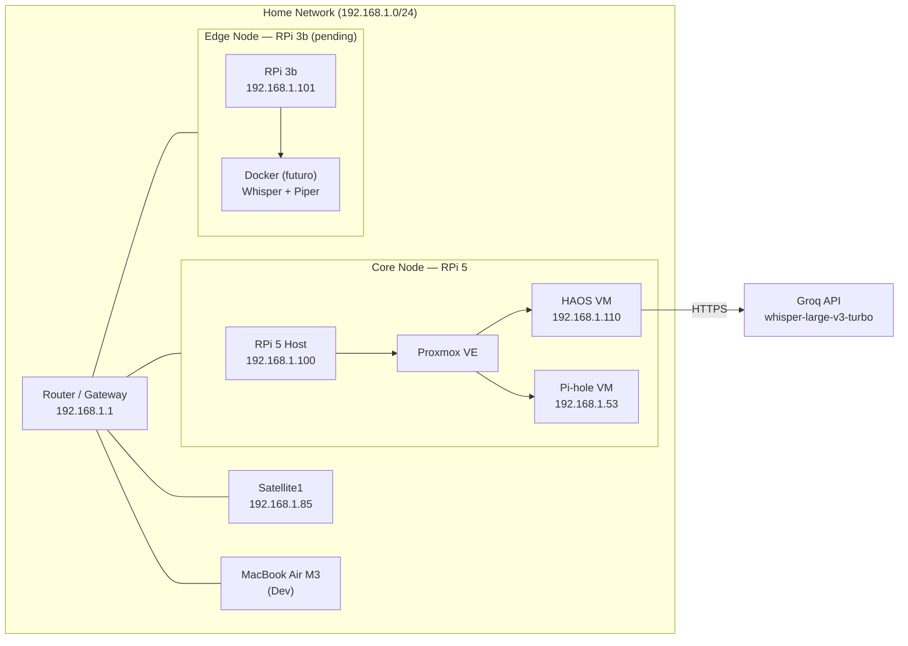
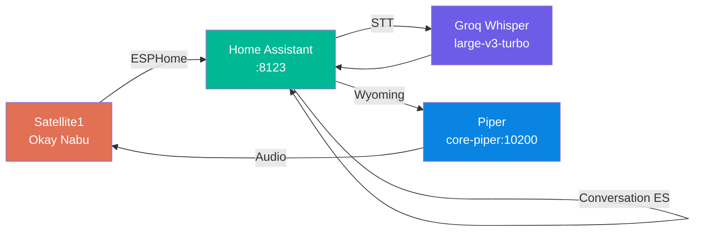
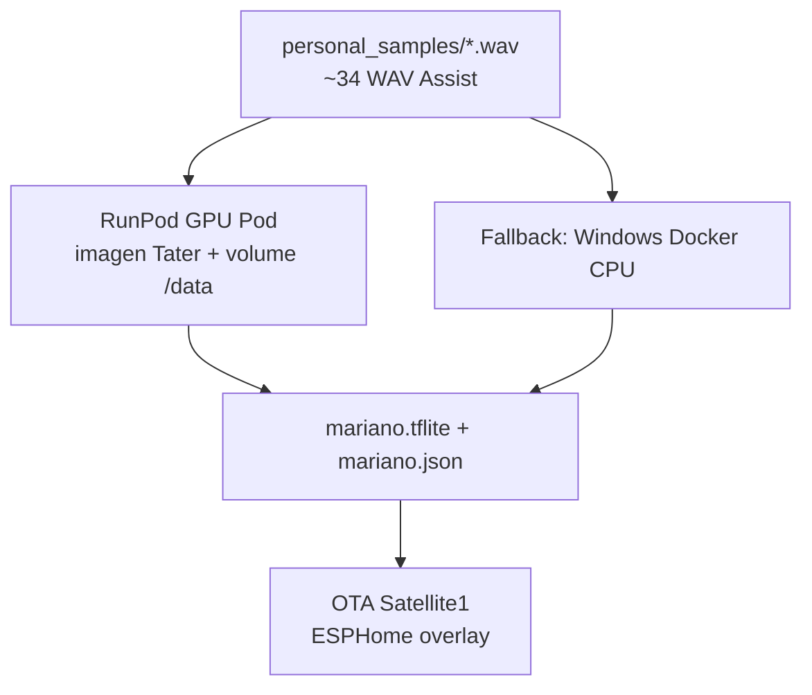

# Architecture — WayneHomelab

## Network Topology

## IP Address Assignment

| Device | IP | Hostname | Role |
|--------|----|----------|------|
| RPi 5 Host | 192.168.1.100 | waynelab-core | Proxmox VE host |
| Pi-hole VM (VMID 101) | 192.168.1.53 | pihole | DNS sinkhole (bridged vmbr0); DHCP sigue en router |
| HAOS VM | 192.168.1.110:8123 | homeassistant | Home Assistant (bridged vmbr0) |
| RPi 3b | 192.168.1.101 | waynelab-edge | Edge (no operativo aún) |
| Satellite1 | 192.168.1.85 | — | ESPHome mic + speaker |
| Lámpara Xiaomi | 192.168.1.121 | — | Xiaomi Miot Auto |
| Bombilla Antela | 192.168.1.122 | — | Tuya (pendiente Local Tuya) |
| MacBook | DHCP | — | Development |
| Training PC | DHCP | — | Windows 11, fallback train CPU |

## Voice Pipeline — Current Data Flow

### Flow detail

1. **Wake word** — Satellite1 detecta «Okay Nabu» on-device (objetivo: MicroWakeWord «Mariano»).
2. **STT** — Audio a HA → integración `openai_whisper_cloud` → Groq. Whisper local en HA está **parado** (alucina en español con audio Satellite1).
3. **NLU** — Conversation agent built-in de HA (español). Gemini queda como mejora futura.
4. **TTS** — Piper Wyoming (`es_ES-davefx-medium`) en el add-on.
5. **Salida** — Audio de vuelta al speaker del Satellite1.

### Ports

| Service | Port | Notes |
|---------|------|-------|
| Home Assistant | 8123 | HTTP LAN (HTTPS pendiente) |
| Pi-hole DNS | 53/tcp+udp | VM `192.168.1.53` (tras cutover router) |
| Pi-hole Admin | 80 | `http://192.168.1.53/admin` |
| Piper Wyoming | 10200 | Add-on HAOS |
| Proxmox UI | 8006 | Host RPi 5 |
| SSH host | 22 | user `pi` |
| RunPod trainer UI | 8789 | Solo durante train Mariano |

## Wake word training (Mariano)

- Guía PC: [runpod-train-mariano.md](runpod-train-mariano.md)
- Guía móvil: [runpod-train-mariano-movil.md](runpod-train-mariano-movil.md)
- Runbook: [wake-word-mariano.md](wake-word-mariano.md)
- Volume recomendado: **200 GB** (100 GB se llena al extraer AudioSet sin cleanup)

## Home Assistant config layout

YAML canónico en el repo → Samba `/config`:

| Repo | Destino HAOS |
|------|----------------|
| `home-assistant/configuration.yaml` | `/config/configuration.yaml` |
| `home-assistant/includes/*.yaml` | `/config/*.yaml` (o includes según `configuration.yaml`) |
| `home-assistant/themes/` | `/config/themes/` |

Entity IDs reales documentados en `AGENTS.md` y `includes/scripts.yaml`.

## Design decisions

| Decision | Rationale |
|----------|-----------|
| Groq STT vs Whisper local | Calidad ES con mic Satellite1; Whisper tiny/base/small alucina |
| Piper en HAOS vs edge | Edge RPi 3b aún no operativo; un solo nodo menos latencia de red |
| Pi-hole en VM propia | DNS aislado de HAOS; 768 MiB en host 8 GB; DHCP permanece en el router |
| RunPod para Mariano | Mac sin disco; Windows solo AMD (sin CUDA); GPU on-demand puntual |
| Network volume 200 GB | Primer train con AudioSet+FMA+CHiME supera 100 GB si no se borran tars |
| No Spot / Instant Cluster | Preemption o multi-nodo innecesario para MicroWakeWord |

## Related docs

- [setup-desde-cero-ssd-pi5-haos.md](setup-desde-cero-ssd-pi5-haos.md)
- [setup-from-scratch-headless.md](setup-from-scratch-headless.md)
- [pihole.md](pihole.md)
- [speaker-id-mariano.md](speaker-id-mariano.md)
- [api-costs.md](api-costs.md)
- [reservas-dhcp-bombillas-iot.md](reservas-dhcp-bombillas-iot.md)
