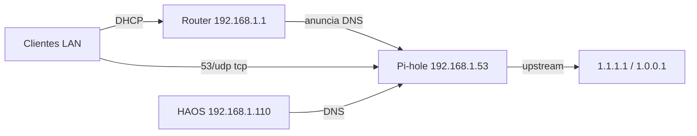

# Pi-hole — VM en Proxmox (RPi 5)

DNS sinkhole de red en una **VM QEMU** Debian 12 ARM64 (Pi-hole nativo v6).  
DHCP sigue en el router; Pi-hole solo resuelve DNS.

| Campo | Valor |
|-------|--------|
| Host | `waynelab-core` `192.168.1.100` (PXVIRT 9 / Debian 13 trixie, ~8 GB) |
| VMID | `101` (`onboot=1`, `startup order=1`) |
| Hostname guest | `pihole` |
| Guest OS | Debian 12 (bookworm) cloud image |
| IP | `192.168.1.53/24` |
| MAC `net0` | `bc:24:11:69:81:fe` |
| Recursos | 1 vCPU, **768 MiB** RAM, balloon 256, disco **8G** (`local`) |
| Upstream DNS | `1.1.1.1`, `1.0.0.1` (sin Unbound en v1) |
| Admin UI | `http://192.168.1.53/admin` |
| Estado (2026-08-26) | VM + Pi-hole **instalados**. `verify_pihole.sh` OK. **Cutover router pendiente** (probar Mac → móvil antes). |

Referencias oficiales:

- [Pi-hole prerequisites](https://docs.pi-hole.net/main/prerequisites/) (IP estática, ≥512 MiB RAM)
- [Post-install / router DNS](https://docs.pi-hole.net/main/post-install/)
- [FTL config (`pihole.toml`)](https://docs.pi-hole.net/ftldns/configfile/) — v6 ya no usa `setupVars.conf`
- [Proxmox `qm` / cloud-init](https://pve.proxmox.com/pve-docs/qm.adoc)

---

## 0) Reserva DHCP

En el router, reserva **`192.168.1.53`** → MAC **`bc:24:11:69:81:fe`**.

Ver también [reservas-dhcp-bombillas-iot.md](reservas-dhcp-bombillas-iot.md).

---

## 1) Crear la VM (en el host Proxmox)

Desde el Mac:

```bash
cd /Users/miguel/Proyectos/WayneHomeLab

scp infrastructure/proxmox/create_pihole_vm.sh pi@192.168.1.100:/tmp/

# Preferir la pubkey del usuario pi (no la de root bajo sudo):
ssh -t pi@192.168.1.100 \
  'sudo SSH_KEY_FILE=/home/pi/.ssh/authorized_keys bash /tmp/create_pihole_vm.sh'
```

Overrides útiles:

```bash
sudo MEMORY=768 BALLOON=256 \
  SSH_KEY_FILE=/home/pi/.ssh/authorized_keys \
  bash /tmp/create_pihole_vm.sh --recreate
```

El script:

1. Comprueba `pve-cluster` / `pvestatd`
2. Descarga `debian-12-generic-arm64.qcow2` → `/var/lib/vz/template/iso/`
3. Crea VM 101 (`arch=aarch64`, `machine=virt`, `bios=ovmf`, cloud-init en **SCSI**)
4. IP estática `192.168.1.53/24`, gw `192.168.1.1`, nameserver temporal `1.1.1.1`
5. `onboot=1`, `startup order=1` (DNS antes que HAOS)
6. Arranca la VM

Espera ~60–90 s y prueba:

```bash
ping -c 2 192.168.1.53
ssh pi@192.168.1.53
```

### Lección: SSH `Permission denied (publickey)`

Si el script se lanza con `sudo` **sin** `SSH_KEY_FILE`, puede inyectar la clave de `root@waynelab-core` (no la del Mac). El script actual prioriza `/home/pi/.ssh/authorized_keys` y `SUDO_USER`.

Reparar sin recrear (desde el host):

```bash
ssh -t pi@192.168.1.100 \
  "sudo ssh -i /root/.ssh/id_rsa -o StrictHostKeyChecking=no pi@192.168.1.53 \
   'echo $(cat ~/.ssh/id_ed25519.pub) >> ~/.ssh/authorized_keys'"
```

Referencia de config (no aplicar a mano): [`infrastructure/proxmox/pihole.conf`](../infrastructure/proxmox/pihole.conf).

---

## 2) Instalar Pi-hole en el guest

```bash
cd /Users/miguel/Proyectos/WayneHomeLab

scp infrastructure/nodes/pihole/install_pihole.sh \
    infrastructure/nodes/pihole/pihole.toml.example \
    pi@192.168.1.53:/tmp/

# Elige una contraseña fuerte (NO la commits)
ssh -t pi@192.168.1.53 \
  'sudo PIHOLE_WEBPASSWORD="TU_PASSWORD_FUERTE" bash /tmp/install_pihole.sh'
```

El instalador:

- Instala `qemu-guest-agent`, fija `Europe/Madrid`
- Pone `manage_etc_hosts: false` en cloud-init del guest
- Pre-siembra `/etc/pihole/pihole.toml` (v6 unattended)
- Ejecuta `basic-install.sh --unattended` y `pihole -g`

UI: `http://192.168.1.53/admin` (HTTP 308 a `/admin/` es normal en v6).

---

## 3) Verificación (servicio vivo; DNS del Mac aún puede ser el del ISP)

```bash
bash infrastructure/nodes/pihole/verify_pihole.sh
```

Esperado: ping OK, `google.com` resuelve, `doubleclick.net` → `0.0.0.0`, `pi.hole` → `192.168.1.53`, UI HTTP 2xx/3xx.

Esto **no** prueba aún tu Mac/móvil como cliente diario. Para eso, §4.

---

## 4) Cutover DNS por fases



Hasta el cutover del router, **solo** los clientes que configures a mano usan Pi-hole.

### Fase A — Solo el Mac (sin tocar el router)

1. **System Settings → Network → Wi‑Fi (o Ethernet) → Details → DNS.**
2. Anota los DNS actuales (rollback).
3. Deja solo `192.168.1.53`.
4. Confirma:

```bash
scutil --dns | head -40          # nameserver 192.168.1.53
dig google.com +short            # sin @ — debe usar Pi-hole
dig doubleclick.net +short       # 0.0.0.0
open http://192.168.1.53/admin   # Query Log debe mostrar tu Mac
```

Checklist (~15–30 min de uso):

- [ ] Navegación normal
- [ ] HA `http://192.168.1.110:8123`
- [ ] Assist / Satellite1 (wake + frase habitual)
- [ ] SSH `pi@192.168.1.100`
- [ ] Sin roturas por overblocking (si falla algo crítico → whitelist en Query Log)

**Rollback Mac:** restaura los DNS anotados. El resto de la LAN no se entera.

### Fase B — Un móvil (aún sin router)

1. iPhone: **Ajustes → Wi‑Fi → (i) → Configurar DNS → Manual** → solo `192.168.1.53`.
2. Desactiva **iCloud Private Relay** durante la prueba (bypasea DNS local).
3. Prueba apps, HA Companion, Xiaomi/Tuya/Alexa local (lámpara).
4. Query Log debe mostrar la IP del móvil.

**Rollback móvil:** DNS otra vez **Automático**.

### ¿Cuándo tocar el router? (go / no-go)

Solo si se cumplen **todos**:

1. Mac con DNS Pi-hole OK durante un rato de uso real (ideal: horas / un día ligero).
2. Móvil OK, incluida IoT crítica (lámpara / Companion).
3. Query Log con tráfico real (no solo `dig` de prueba).
4. Ningún fallo que “desaparezca” al volver al DNS del ISP sin haber whitelisteado antes.
5. Sabes el rollback: DNS LAN del router → ISP o `1.1.1.1`.

### Fase C — Router

1. Reserva DHCP `.53` → MAC `bc:24:11:69:81:fe` (si no está).
2. DNS LAN / opción DHCP = `192.168.1.53`.
3. Burn-in: secundario `1.1.1.1` opcional (más seguro, menos bloqueo estricto); quítalo cuando sea estable.
4. Renueva leases (olvidar Wi‑Fi en iPhone; en Mac: `sudo dscacheutil -flushcache; sudo killall -HUP mDNSResponder`).

**No** actives el DHCP de Pi-hole. Upstream del propio Pi-hole = Cloudflare (no loop a sí mismo).

### Rollback global

1. Router: DNS → ISP / `1.1.1.1`.
2. Opcional: `ssh -t pi@192.168.1.100 'sudo qm stop 101'`.

---

## Troubleshooting

| Síntoma | Causa probable | Acción |
|---------|----------------|--------|
| `pve-cluster` down tras reboot | `/etc/hosts` → `127.0.1.1` | `fix_proxmox_cluster.sh` + `qm start 100` (y 101) |
| SSH Mac → guest denied | Cloud-init con clave de root | `SSH_KEY_FILE=/home/pi/.ssh/authorized_keys` o añadir pubkey vía host (§1) |
| VM no coge IP | Cloud-init / bridge | serial / `ipconfig0` |
| Ads siguen saliendo | DNS2 / DoH / Private Relay / IPv6 | Quitar DNS2; desactivar Private Relay/DoH en prueba; revisar DNS IPv6 del router |
| Xiaomi / Tuya no conectan | Lista agresiva | Whitelist en Query Log; no añadir listas extras el día 1 |
| `dig @192.168.1.53` timeout | FTL caído | `ssh pi@192.168.1.53 'sudo systemctl status pihole-FTL'` |
| Warnings Perl en `qm list` | Bug PXVIRT/QemuServer en ARM | Cosmético si status es correcto |
| UI HTTP 308 | Redirect v6 a `/admin/` | Normal |

---

## Fuera de alcance (v1)

- Pi-hole como servidor DHCP  
- Unbound / DNSSEC agresivo  
- Integración estadísticas en Home Assistant  
- HTTPS en la UI  
- Docker / LXC  

---

## Checklist

- [x] VM creada (`qm status 101` running)
- [x] SSH `pi@192.168.1.53` (pubkey Mac)
- [x] `install_pihole.sh` + UI `/admin`
- [x] `verify_pihole.sh` OK (resolve + block + UI)
- [ ] Reserva DHCP `192.168.1.53` → `bc:24:11:69:81:fe`
- [ ] Fase A: Mac DNS → Pi-hole (uso real)
- [ ] Fase B: un móvil + IoT OK
- [ ] Go/no-go (§4) → Fase C cutover router
- [ ] Rollback mental / probado
