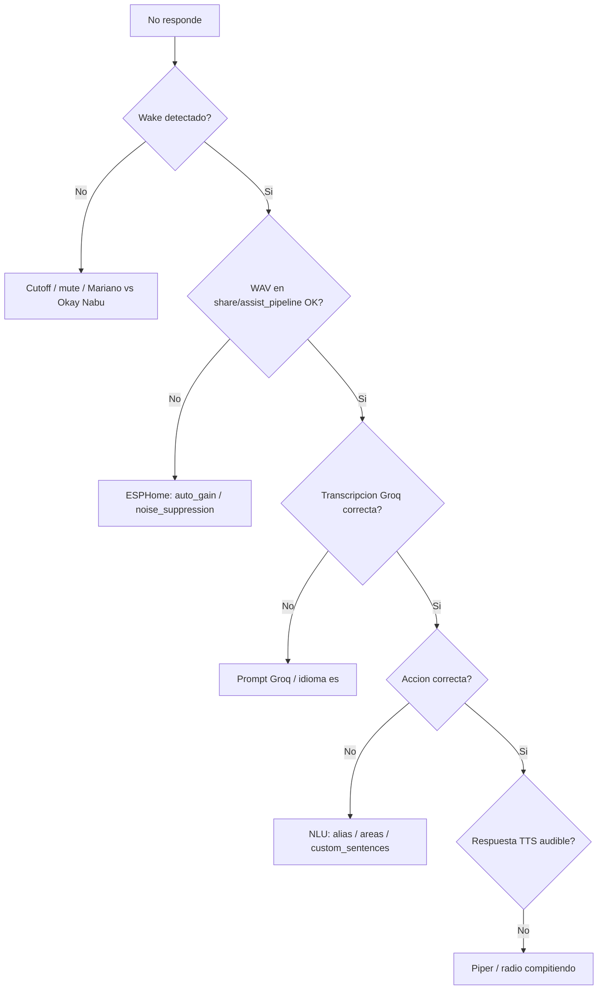

# Wake word "Mariano" — Runbook WayneHomeLab

Guía operativa para entrenar, desplegar y afinar la wake word personalizada en Satellite1.

## Arquitectura

```
Satellite1 (MicroWakeWord "Mariano" on-device)
  → ESPHome voice_assistant → HA Assist Pipeline
  → Groq Whisper (STT) → Conversation (es) → Piper (TTS)
```

## 1. Entrenar el modelo

El Mac M3 **no tiene disco suficiente** para un train completo (~25–80 GB de TTS, features y negativos). El camino **recomendado** es un **GPU Pod on-demand en RunPod** (1× NVIDIA). Windows 11 + Docker CPU (RX 6750 XT) queda como fallback local. El trainer de Apple Silicon se mantiene como Plan B si hay disco.

### Hardware del PC de entrenamiento

| Componente | Este lab |
|------------|----------|
| Placa | Gigabyte B550M DS3H |
| CPU | AMD Ryzen 5 3600 (6c/12t) |
| GPU | **AMD Radeon RX 6750 XT** (RDNA2, gfx1031) |
| RAM | 16 GB (2×8) |
| Fuente | Seasonic CORE GM-650 |
| OS | Windows 11 + Docker Desktop / WSL2 |

**CUDA no aplica.** `--gpus all` y `nvidia-smi` son para NVIDIA. ROCm oficial **no cubre** la RX 6750 XT (gfx1031: Runtime/HIP SDK ❌). DirectML no está en la imagen Tater. El punto de partida en este PC es la **misma imagen Docker en CPU** (`-Cpu` / `--cpu`).

16 GB de RAM es justo: cierra Chrome/juegos y, en `%UserProfile%\.wslconfig`, limita WSL2 (`memory=10GB`). Disco: **≥ ~80 GB libres** la primera vez.

```powershell
cd ...\WayneHomeLab\infrastructure\voice\wake-word
.\probe_trainer_windows.ps1    # GPU/RAM/disco/Docker; debe recomendar CPU
```

### Captura de muestras

1. Di «Okay Nabu… Mariano» al Satellite1 (variando distancia/ruido).
2. Copia WAV STT desde `/share/assist_pipeline/` (Samba: `smb://192.168.1.110/share`) a `~/Desktop/mariano_raw/`.
3. Descarta clips donde el pitido periódico pise la palabra.
4. `train_mariano_local.sh` (Mac) o `export_personal_samples.sh` deja los WAV en `personal_samples/` con **100 ms de silencio al final** si vienen del pipeline Assist. Sin ese padding, `trim_silence.py` puede dejar clips a 0 ms y perder el último fonema.
5. El mensaje `Skipped N: personal_samples/... Trailing silence ≤ 20ms` **no descarta** el WAV: solo significa que no hace falta recortar más silencio.

Las muestras personales **no se commitean**. Viven en:

| Sitio | Rol |
|-------|-----|
| `~/.taterwakewordtrainer/app/current/personal_samples/` | Mac, padded, listas para train |
| `~/Desktop/mariano_raw/` | Captura cruda Assist |
| `infrastructure/voice/wake-word/personal_samples/` | Carpeta de transferencia (gitignored `*.wav`) |

### Liberar disco en el Mac (conservar solo muestras)

```bash
# 1) Exportar WAV al repo (para USB / scp al PC Windows)
./infrastructure/voice/wake-word/export_personal_samples.sh

# 2) Borrar TTS, features, negativos, Piper, .venv, .cache — keep-personal
./infrastructure/voice/wake-word/free_trainer_disk.sh --keep-personal
```

`--keep-personal` borra artefactos regenerables y **conserva** `personal_samples/`. Otros modos: `--resume`, `--aggressive` (ver `--help`).

### A) Método principal — Windows 11 + Docker CPU (este PC: RX 6750 XT)

TensorFlow+CUDA no es fiable en Windows nativo. Usar **Docker Desktop (backend WSL2)** y la imagen [TaterTotterson/microWakeWord-Trainer-Nvidia-Docker](https://github.com/TaterTotterson/microWakeWord-Trainer-Nvidia-Docker) **sin** `--gpus all`. La generación TTS/features ya es sobre todo CPU; el train del modelo MicroWakeWord en Ryzen 5 3600 será más lento que en NVIDIA, pero es el camino que funciona hoy.

```powershell
# En el clone, con personal_samples/*.wav ya copiados desde el Mac
cd ...\WayneHomeLab\infrastructure\voice\wake-word
.\probe_trainer_windows.ps1
.\setup_trainer_windows.ps1 -Cpu     # pull imagen, volumen %USERPROFILE%\mww-data, SIN --gpus
.\train_mariano_windows.ps1 -Cpu     # sincroniza WAV y arranca el contenedor
```

Si un `docker run --gpus all` falló antes: `docker rm -f waynelab-mww-trainer` y vuelve a lanzar con `-Cpu`.

Equivalente en WSL2 / Git Bash:

```bash
./infrastructure/voice/wake-word/setup_trainer_nvidia.sh --cpu
./infrastructure/voice/wake-word/train_mariano_nvidia.sh --cpu
# Solo ver comandos: ./setup_trainer_nvidia.sh --cpu --dry-run
```

### A2) Si en el futuro hay GPU NVIDIA

El mismo script detecta `nvidia-smi` y usa `--gpus all`. RTX 50-series: `-Blackwell` / `--blackwell`. No combines `-Blackwell` con `-Cpu`.

UI: `http://127.0.0.1:8789` → Trainer → wake word **mariano** → language **Spanish** → confirma `personal_samples` → **Start training**.

Artefactos: `%USERPROFILE%\mww-data\trained_wake_words\mariano.{tflite,json}` (en el contenedor: `/data/trained_wake_words/`).

```bash
# Desde Git Bash / WSL, copiar al repo:
WAKEWORD_TRAINER_DATA_DIR="$HOME/mww-data" \
  ./infrastructure/voice/wake-word/copy_model_from_trainer.sh
```

`--network host` **no** se usa: Docker Desktop en Windows necesita `-p 8789:8789`.

### B) Plan B — Mac Apple Silicon (disco ≥ ~25 GB libres)

```bash
cd /Users/miguel/Proyectos/WayneHomeLab
./infrastructure/voice/wake-word/free_trainer_disk.sh
./infrastructure/voice/wake-word/setup_trainer_macos.sh ui   # opcional, :8789
./infrastructure/voice/wake-word/train_mariano_local.sh
tail -f ~/Proyectos/microWakeWord-Trainer-AppleSilicon/training_mariano.log
```

`caffeinate` no basta: el script usa `nohup` + `disown`. Variables: `MWW_MAX_SAMPLES`, `MWW_PERSONAL_SRC`, `--no-copy-personal`, `--foreground`.

### C) Plan C — Google Colab

Notebook [PrismaKisar/micro-wake-word](https://github.com/PrismaKisar/micro-wake-word), `language="Spanish"`. Menos fiable por desconexiones. Útil si Docker CPU en 16 GB RAM hace OOM.

### D) Método recomendado — RunPod GPU Pod (1× NVIDIA, on-demand)

**Guía de inicio paso a paso:** [runpod-train-mariano.md](runpod-train-mariano.md) (billing, volume vs GPU, cuánto recargar, checklist). **Desde el móvil (sin Mac):** [runpod-train-mariano-movil.md](runpod-train-mariano-movil.md).

**No uses Instant Cluster.** Ese producto es multi-nodo (H100/A100) para LLM. MicroWakeWord cabe en **1 GPU**. **Nunca Spot**: RunPod puede matarlo con SIGTERM a 5 s.

Imagen: la misma Tater que el trainer NVIDIA local (`ghcr.io/tatertotterson/microwakeword:latest`). RTX 50-series: `--blackwell`. Scripts:

```bash
./infrastructure/voice/wake-word/setup_trainer_runpod.sh --dry-run
./infrastructure/voice/wake-word/train_mariano_runpod.sh --dry-run
# Al acabar (modelo ya en el PC): teardown_runpod_trainer.sh [--delete-volume]
```

`--dry-run` **no crea** el pod (hace falta tu API key / consola). Pega el `runpodctl pod create` que imprime el setup, o despliega a mano.

#### Precios (verificar en la consola al Deploy)

La [página oficial](https://docs.runpod.io/pods/pricing) no fija tarifas: el $/h sale al crear el Pod. Referencias on-demand (ago 2026):

| GPU | Cloud | ~$/h | Notas |
|-----|-------|------|--------|
| RTX A4000 / A5000 | Community | 0.16–0.17 | Barata, 16–24 GB, suficiente |
| RTX 3090 | Community | 0.22 | 24 GB |
| **RTX 4090** | **Community** | **0.34** | **Recomendada** |
| RTX 4090 | Secure | 0.69–0.74 | Si Community no tiene stock |
| A40 / L40S / A100 / H100 | — | 0.44–2.89 | Overkill para este train |

Network volume: **$0.07/GB/mes** (&lt;1 TB) → **200 GB** ≈ **$0.47/día** (recomendado; 100 GB se agota en AudioSet). Ingress/egress: $0.

La 1ª pasada gasta horas sobre todo en TTS/features (CPU+disco, 25–80 GB), no en el fit TensorFlow. Estimación realista: **4–24 h**. A $0.34/h, 24 h ≈ $8; 48 h ≈ $16. El riesgo de presupuesto es **olvidarse de parar el pod**.

`$5` de saldo ≈ 14 h de 4090 Community: **no bastan** para garantizar continuidad. Recarga **antes** de desplegar.

#### Techo de gasto 40–50€

RunPod **no** tiene «no gastes más de 50€». El *Spend limit* de [billing](https://docs.runpod.io/accounts-billing/billing) es **$80/hora** (tasa anti-fraude), no un cap de campaña. Los créditos **no se reembolsan**.

1. [Billing](https://www.console.runpod.io/user/billing): **Auto-pay OFF**.
2. Deposita **un solo tramo de $50–55** (≈46–51€). Esa cartera **es** el máximo.
3. Low balance alert: umbral **$10** (email; no para el pod).
4. Deploy con `--stop-after 48h` (conserva el network volume). **No** uses `--terminate-after` sin volume: borra el disco local.
5. On-demand, **nunca Spot**. Community Cloud; Secure solo si no hay stock.
6. Al terminar: **Stop** el pod, descarga el modelo, **borra el volume** ($0.23/día si lo dejas).

Si el saldo llega a $0, RunPod para todos los pods. **Con network volume los datos se conservan**; sin él se **pierden**.

#### Continuidad (que no se corte)

| Riesgo | Mitigación |
|--------|------------|
| Saldo a $0 | Recargar $50–55 **antes**; alerta $10 |
| Spot / Instant Cluster | Pod on-demand, 1 GPU |
| Caída de SSH / browser | `train_wake_word` en `tmux`/`nohup`; UI `8789/http` |
| Host Community inestable | Volume en el **mismo datacenter**; reanudar montando el mismo volume |
| Disco efímero | Mount **`/data`** (contrato Tater) |
| Olvidar parar | `--stop-after 48h` + Stop manual al ver artefactos |

#### Pasos

1. Network volume **200 GB** (EU-RO-1 si hay GPU allí). Wrapper `tar --no-same-owner` en el pod.
2. GPU Pod: 1× RTX 4090 Community, container disk 40–50 GB, volume en `/data`, puertos `8789/http` (y `22/tcp` si montas SSH).
3. Subir WAV (gitignored): `train_mariano_runpod.sh` → `runpodctl send` a `/data/personal_samples/`.
4. En el pod: `nvidia-smi` debe ver CUDA. Preferible CLI:

   ```bash
   tmux new -s mariano
   train_wake_word --language=Spanish mariano
   ```

   UI: Connect → HTTP 8789 → Trainer → **mariano** / **Spanish** → confirma `personal_samples` → Start training.

   La imagen Tater **no** trae `/start.sh` de RunPod: SSH/Jupyter pueden no arrancar. Usa Web Terminal + proxy HTTP. SSH: ver [use-ssh](https://docs.runpod.io/pods/configuration/use-ssh).
5. Artefactos: `/data/trained_wake_words/mariano.{tflite,json}` → `runpodctl receive` a `$HOME/mww-runpod/trained_wake_words/`.
6. En el PC: `teardown_runpod_trainer.sh` (verifica + **Stop**). El volume solo se borra con `--delete-volume`.

```bash
MWW_RUNPOD_DATA_DIR="$HOME/mww-runpod" \
  ./infrastructure/voice/wake-word/copy_model_from_trainer.sh
```

### Artefactos

Tras un train OK:

- RunPod GPU Pod: `$HOME/mww-runpod/trained_wake_words/mariano.{tflite,json}` (`MWW_RUNPOD_DATA_DIR`)
- Windows/Docker (CPU o NVIDIA): `$HOME/mww-data/trained_wake_words/mariano.{tflite,json}`
- Mac: `~/.taterwakewordtrainer/app/current/trained_wake_words/mariano.{tflite,json}`

```bash
./infrastructure/voice/wake-word/copy_model_from_trainer.sh
# → infrastructure/voice/wake-word/models/
```

## 2. Servir modelo en LAN

```bash
./infrastructure/voice/wake-word/serve_model.sh
# JSON: http://<IP_MAC>:8765/mariano.json
```

Actualizar IP en [`satellite1_mariano_overlay.yaml`](../infrastructure/voice/wake-word/satellite1_mariano_overlay.yaml).

## 3. Flashear Satellite1 con modelo Mariano

1. HA → ESPHome Device Builder → **Take Control** del Satellite1
2. EDIT → añadir bloque de [`satellite1_mariano_overlay.yaml`](../infrastructure/voice/wake-word/satellite1_mariano_overlay.yaml)
3. **INSTALL** (OTA)
4. HA → Dispositivos → Satellite1 → Configuración:
   - Pipeline de voz (Groq + Piper)
   - Wake word: **Mariano**
   - Sensitivity: **Slightly sensitive**

### Calibrar `probability_cutoff`

El entrenamiento puede sugerir **98%**, pero en la sala real suele ser demasiado estricto.
Calibra por escalones, midiendo detecciones a 1 m y 3 m y falsos positivos con TV:

| Paso | Cutoff | Cuándo probarlo |
|------|--------|-----------------|
| 1 | 92% | Punto de partida recomendado tras flash |
| 2 | 85% | Si no despierta con voz normal |
| 3 | 98% | Solo si hay falsos positivos frecuentes con TV |

| Síntoma | Ajuste |
|---------|--------|
| Falsos positivos con TV | Subir cutoff (85% → 92% → 98%) + automatizaciones TV en HA |
| No detecta tu voz | Bajar cutoff (98% → 92% → 85%) |

Cambiar en YAML → recompilar → flash OTA. No cambiar varios parámetros a la vez.

### Diagnóstico por etapa



## 4. Automatizaciones TV (HA)

```bash
HA_HOST=192.168.1.110 ./infrastructure/voice/wake-word/deploy_ha_voice_config.sh
```

Automatizaciones en [`automations.yaml`](../home-assistant/includes/automations.yaml):

- `satellite1_mute_tv_playing` — mute al reproducir TV
- `satellite1_unmute_tv_stopped` — unmute tras 5 min parada

Verificar entity_ids de media_player en HA si difieren de:

- `media_player.sony_bravia_4k`
- `media_player.google_tv_streamer`

## 5. Diagnosticar STT ("no me entiende")

`assist_pipeline.debug_recording_dir` activo en [`configuration.yaml`](../home-assistant/configuration.yaml).

1. Reproducir un fallo
2. Escuchar WAV en `/share/assist_pipeline`
3. Clasificar:
   - Audio malo → subir `auto_gain` / `noise_suppression_level` en ESPHome
   - Transcripción mala → revisar idioma es en pipeline Groq
   - Transcripción OK, acción mala → alias/entidades ([`voice_assist.yaml`](../home-assistant/includes/voice_assist.yaml))

**Desactivar debug** tras 2–3 días (comentar bloque `assist_pipeline`).

## Quick wins (sin reentrenar)

- `select.satellite1_c7ffe4_wake_word_sensitivity` → Slightly sensitive
- Bajar `probability_cutoff` a 92% (o 85% si sigue sin despertar) y flash OTA
- Desplegar automatizaciones TV: `HA_HOST=192.168.1.110 ./infrastructure/voice/wake-word/deploy_ha_voice_config.sh`
- Aplicar overlay `voice_assistant` (`noise_suppression_level: 2`, `auto_gain: 12 dBFS`)
- Exponer entidades con alias español en HA UI
- Prompt Groq con vocabulario doméstico: tele, televisión, tv, radio, lámpara, bombilla

## Referencias

- [FutureProofHomes FAQs](https://docs.futureproofhomes.net/satellite1-faqs/)
- [ESPHome micro_wake_word](https://esphome.io/components/micro_wake_word/)
- [TaterTotterson Trainer Apple Silicon](https://github.com/TaterTotterson/microWakeWord-Trainer-AppleSilicon)
- [TaterTotterson Trainer NVIDIA Docker](https://github.com/TaterTotterson/microWakeWord-Trainer-Nvidia-Docker)
- [RunPod Pods pricing](https://docs.runpod.io/pods/pricing)
- [RunPod billing (Auto-pay, low balance, spend limit)](https://docs.runpod.io/accounts-billing/billing)
- [RunPod SSH en templates custom](https://docs.runpod.io/pods/configuration/use-ssh)
- [CUDA en WSL2](https://learn.microsoft.com/windows/ai/directml/gpu-cuda-in-wsl) (solo si hay NVIDIA)
- [ROCm Windows GPU matrix](https://rocm.docs.amd.com/projects/install-on-windows/en/develop/reference/system-requirements.html) (RX 6750 XT = no soportada)
